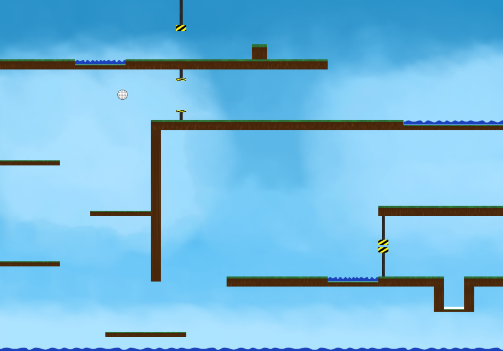
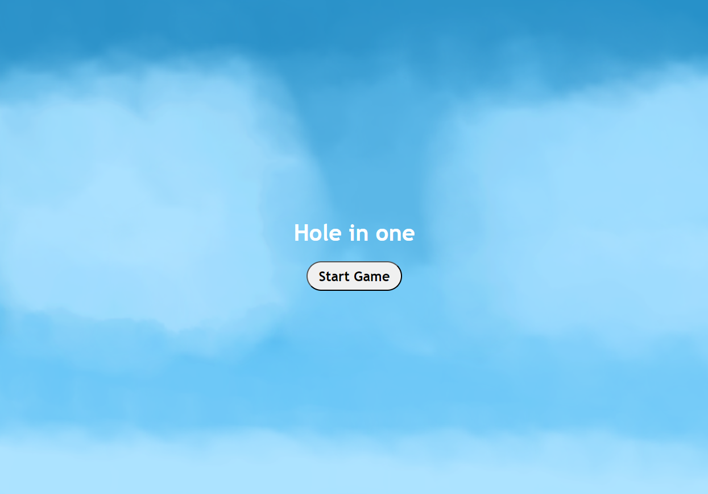
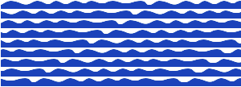

# CCL1
# 🎮 **Hole in One** 

This mini-golf puzzle game challenges your precision and strategic thinking! Can you guide the ball through all levels filled with tricky obstacles? Remember, the fewer strokes you take, the better your score. Aim wisely and master the course!

## 📸 **Screenshots**

### Main Gameplay:

  
  
 Gameplay in action.

---

### Menu and UI:

  
  
Startscreen

---

## 🎨 **Spritesheets**
Below are the sprites used to create characters and objects in the game:

### Golf Ball:

  
  
Golf Ball animation-spritesheet.

---

### Waterpit:

  
  
Water animation-spritesheet

---

### Obstacle:

  
  
Water animation-spritesheet

---

## ✍️ **Reflection**

## What Went Well  
- **Level Design:** Designing and testing levels was both fun and rewarding, adding depth to the gameplay.  
- **Mouse Click Movement:** Implementing movement based on mouse clicks worked surprisingly well with the right math.  

## Challenges  
- **Gravity & Movement:** Balancing gravity with smooth movement was tricky. Adjusting `xVelocity` and `yVelocity` was necessary for better control.  
- **Collision Handling:** The `applyGravity` function originally only checked for top and bottom collisions, so I had to add horizontal collision detection.  

## Lessons Learned  
- **Understand Core Functions First:** Fully understanding how `applyGravity` worked was crucial for avoiding unexpected behavior.  
- **Keep It Simple:** At times, I overcomplicated the physics, but a simpler approach often gave the best results.  

